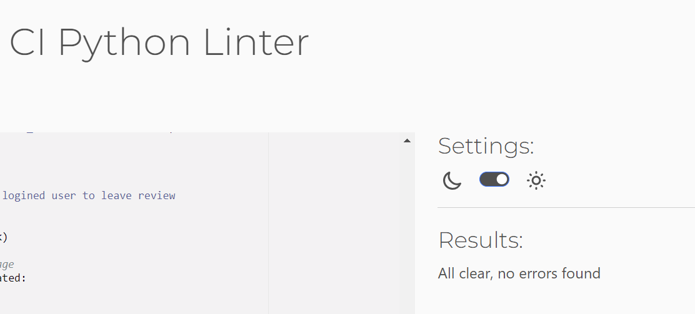
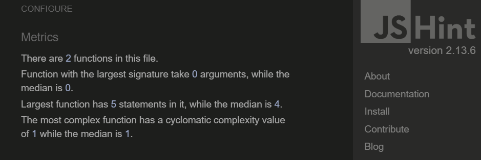
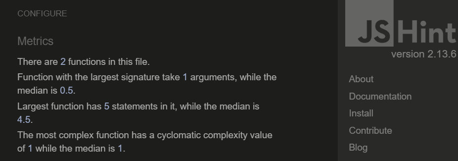
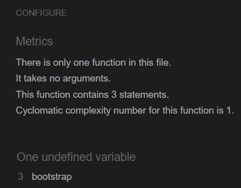
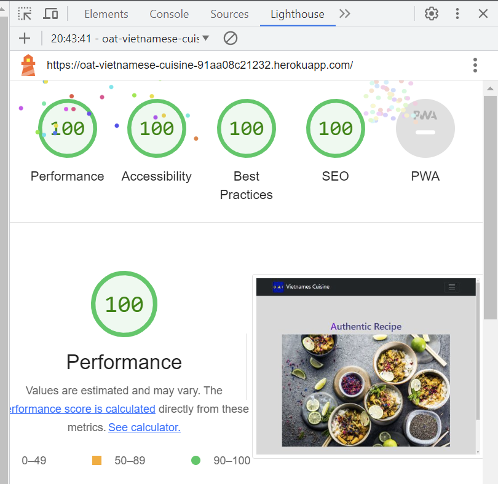
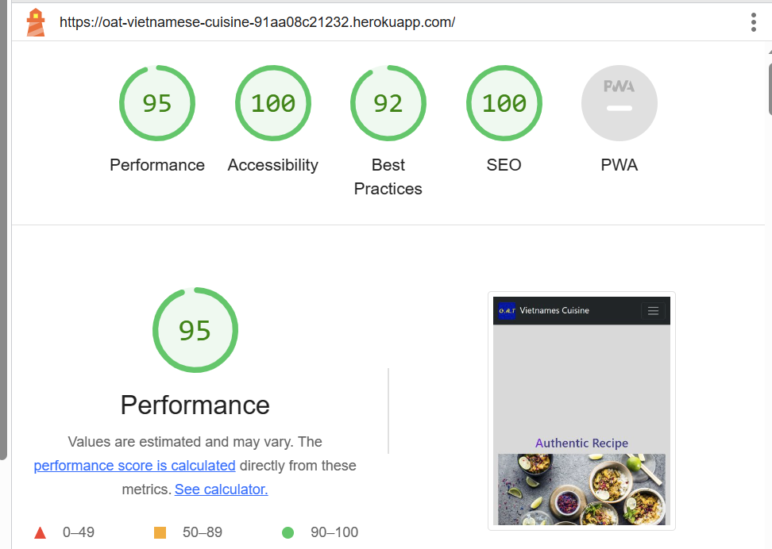
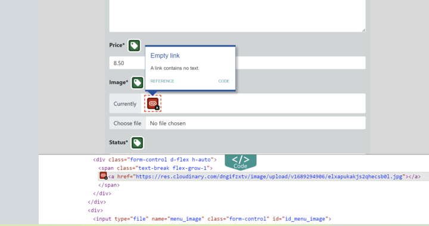

## Functional Testing

**Authentication**

*Register*

Ensure a user can sign up to the website

Steps:

1. Navigate to [O.A.T-Vietnamese-Cuisine](https://oat-vietnamese-cuisine-91aa08c21232.herokuapp.com/) and click ``Register`` at the nav bar
2. Enter Username and Password 
3. Click Sign up

Expected:

A message to confirm a successful register and user will be directed to the home page.

Actual: 

A message popped up to confirm a successful register and user is directed to the home page.

*Login*

Ensure a user can log in once signed up

Steps:
1. Navigate to [O.A.T-Vietnamese-Cuisine](https://oat-vietnamese-cuisine-91aa08c21232.herokuapp.com/) and click ``Login`` at the nav bar
2. Enter login detailscreated in previous test case
3. Click login

Expected:

A message popping up to confirm a successful login and user is directed to the home page.

Actual:

A message popped up to confirm a successful login and user is directed to the home page.

Description:

*Logout*

Steps:

1. Login to the website
2. Click the ``logout`` at navbar
3. Click confirm on the confirm logout page

Expected:

A message came out to confirm User is logged out. Home page is loaded.

Actual:

A message came out to confirm User is logged out. Home page is loaded.

A message poped up to confirm a successful register and user will be directed to the home page
**Menu Page**

*Add Menu*

Ensure a new menu can be created to add to the menu list

Steps:

1. Login as a staff
2. Navigate to the Daily Menu page by clicking ``Menu`` at the nav bar
3. Click on the  <u>Add Menu</u>  at the top of the page and go the Add Menu Page
4. Fill up the Add Menu Form with the following details:
    - Name: Test Menu    
    - Description: Test Item
    - Price: 15.00
    - Image: Any
    - Status: Change from 'Draft' to 'Approved'    
    - Category: choose Main Course from drop down menu

5. Click ``Add Menu``
6. All the above fields are required before submitting the form otherwise an error message appears

Expected:

-New menu item is successfully added and a confirmation message to inform the menu is added
-It can be seen at the Daily Menu page if status is selected as Approved
-It cannot be seen at the Daily Menu page if status is Draft

Actual:

-New menu item is successfully added and a confirmation message appeared to inform the menu is added
-It can be viewed at the Daily Menu page

*Edit Menu*

Ensure a menu can be updated when requires

Steps:

1. Navigate to the ``Daily Menu`` page from the site navbar by clicking on ``Menu``
2. Go to the particular menu which you'd like to update and Click <u>Edit</u> at the footer of that menu cart
3. Edit form is pre-filled with the current menu information and only amend the fields which requires updates
4. Update the menu contents at the Edit Form, and click ``Save``

Expected:

Menu has been updated and a flash message displayed to the user it was updated

Actual: 

Menu has been updated and a flash message displayed to the user it was updated

*Hide/Unhide Menu*

Ensure a menu can be toggled off and add it back to the Daily Menu page

Steps:

1. Navigate to the ``Daily Menu`` page from the site navbar by clicking on ``Menu``
2. Go to the particular menu which you'd like to hide/unhide and Click <u>Hide/Unhide</u> at the footer of that menu cart

Expected:
- After clicking on <u>Hide</u>, the link text changes to <u>Unhide</u>
- Nun Staff users won’t be able to view this menu from the Daily Menu page
- After clicking on <u>Unhide</u>, the link text changes to <u>Hide</u>
- All users can view this menu from the Daily Menu page

Actual:

- After clicking on <u>Hide</u>, the link text changes to <u>Unhide</u>
- Nun Staff users won’t be able to view this menu from the Daily Menu page
- After clicking on <u>Unhide</u>, the link text changes to <u>Hide</u>
- All users can view this menu from the Daily Menu page

*Delete Menu*

Ensure a menu can be deleted from the Daily Menu page

Steps:

1. Navigate to the ``Daily Menu`` page from the site navbar by clicking on ``Menu``
2. Go to the particular menu which you'd like to delete and Click <u>Delete</u> at the footer of that menu cart

Expected:

Menu is deleted and won’t be viewed from Daily Menu

Actual:

Menu is deleted and won’t be viewed from Daily Menu

*View Menu Description*

Ensure a menu’s description can viewed when a user want to know more about it

Steps:

1. Navigate to the ``Daily Menu`` page from the site navbar by clicking on ``Menu``
2. Go to the particular menu which you'd like to have more information and Click ``View Details`` button underneath the Menu name and Price

Expected:

-	A modal box pops out with Menu Name and detailed information including allergies 
-	It can be closed by clicking on the ‘x’ at the modal header or ‘Close’ button at the modal footer

Actual:

-	A modal box pops out with Menu Name and detailed information including allergies 
-	It can be closed by clicking on the ‘x’ at the modal header or ‘Close’ button at the modal footer

**Reviews Page**

*Add Review*

Ensure a review can be left to each menu by users
Steps:
1.	Navigate to the Daily Menu page by clicking ``Menu`` at the nav bar
2.	 Go to the particular menu which you'd like to leave a review and Click ``Leave Review`` button underneath the Menu name and Price
3.	If users are not logged in, they will be directed a login page 
4.	After log in, users are redirected back to the ``Leave Review`` page for the menu they chose 
5.	 Fill up the Leave a Review Form with the following details:
 	- Rating: Choose from the drop down arrow, eg: 4-Very Good  
    	- Contents: Review message
               - Image:  image related to the review (optional)
               -Visit date: dd/mm/yy
4. Click ``Submit``
5. All the above fields except image are required before submitting the form otherwise an error message appears

Expected:

-User is directed to the reviews page for that particular menu with the most recent review listed on the top under the menu name and menu image
-A confirmation message informs the user that the review was left successfully

Actual:

-User is directed to the reviews page for that particular menu with the most recent review listed on the top under the menu name and menu image
-A confirmation message informs the user that the review was left successfully

*View Review and Rating*

Ensure a review and rating can be left to each menu by users

Steps:

1.	Navigate to ``Reviews`` page by clicking on ``Reviews`` at the nav bar
2.	 At here, all users can view the average rating and total number of reviews the menu received from users
3.	Click on the <u> number </u> of the reviews for a particular menu

Expected:

-	Users will be directed to the detailed review page for that menu 
-	Al l the ratings and reviews left by different user are listed there for viewing 

Actual:

-	Users will be directed to the detailed review page for that menu 
-	Al l the ratings and reviews left by different user are listed there for viewing 

*Reply Page*

Ensure a staff can reply a message to the reviews left by users

Steps:

1.	Login as staff
2.	Navigate to ``Reviews`` page by clicking on ``Reviews`` at the nav bar
3.	Click on the <u> number </u> of the reviews for a particular menu which staff would like to view
4.	Navigate to the detailed review page for that menu with all the ratings and reviews left by different users
5.	Find the review to reply, just click on the ``Reply`` button under that review message

Expected:

-	Staff will remain at the detailed review page with updated reply message listed under the review they just replied
-	A confirmation message informs a reply is successful.

Actual:

-	Staff will remain at the detailed review page with updated reply message listed under the review they just replied
-	A confirmation message informs a reply is successful

**Navigation Links**

Testing was performed to ensure all navigation links on the respective pages, navigated to the correct pages as per design. This was done by clicking on the navigation links on each page.

  * Home -> index.html - Visible to all
  * Menus -> menu_list.html - Visible to all
  * View Details -> menu modal - Visible to all
  * Add Menu -> add_menu.html - Visible to staff
  * Edit Menu -> edit_menu.html - Visible to staff
  * Leave Review -> leave_review.html - Button Visible to all but page accessible by logged in users only; Unlogged in users will be directed to login 
  * Reviews -> reviews.html- Visible to all
  * View Details & Rating -> review_details.html - Visible to all
  * Reply -> reply.html – Visible to staff 
  * Login -> login.html - Visible to logged out users
  * Register -> signup.html - Visible to logged out users
  * Logout -> logout.html - Visible to logged in users
  * Contact -> contact.html - Visible to all  
All navigation links directed to the correct pages as expected.

## Negative Testing

 Forms cannot be submitted when required fields are empty

## Unit Testing

Unit tests were created to test menu basic functionality such as templates used and redirects. These can be found in the test_menu_views.py files in the menu app.

Results:

## Accessibility

[Wave Accessibility](https://wave.webaim.org/) tool was used throughout development and for final testing of the deployed website to check for any aid accessibility testing.

Testing was focused to ensure the following criteria were met:

- Color contrasts meet a minimum ratio as specified in [WCAG 2.1 Contrast Guidelines](https://www.w3.org/WAI/WCAG21/Understanding/contrast-minimum.html)
- Heading levels are not missed or skipped to ensure the importance of content is relayed correctly to the end user
- All content is contained within landmarks to ensure ease of use for assistive technology, allowing the user to navigate by page regions
- All not textual content had alternative text or titles so descriptions are read out to screen readers
- HTML page lang attribute has been set
- Aria properties have been implemented correctly
- WCAG 2.1 Coding best practices being followed

## Validator Testing

All pages were run through the [w3 HTML Validator](https://validator.w3.org/). Initially there were some errors due to stray script tags, misuse of headings within spans and some unclosed elements. All of these issues were corrected and all pages passed validation.

Due to the django templating language code used in the HTML files, these could not be copy and pasted into the validator and due to the secured views, pages with login required or a secured view cannot be validated by direct URI. To test the validation on the files, open the page to validate, right click and view page source. Paste the raw html code into the validator as this will be only the HTML rendered code.

All pages were run through the CI [Pep8](https://pep8ci.herokuapp.com/) validator to ensure all code was pep8 compliant. Some errors were shown due to blank spacing and lines too long, 1 line instead of 2 expected. All of these errors were resolved and code passed through validators with the exception of the settings.py file.

The django auto generated code for AUTH_PASSWORD_VALIDATORS were showing up as lines too long. I could not find a way to split these lines but since they were auto generated and not my own custom code, I hope this is acceptable.

JavaScript code was run through [JSHINT](https://jshint.com) javascript validator. lIt flagged up issues with undefined variables as I jad forgotten to use the let keyword. This was fixed and the only warnings remained were that they were unused variables. The functions were called via onclick from the html elements themselves, so are in fact being used.

## Lighthouse Report

Lighthouse report showed areas for improvement on SEO and Best practices. Meta descriptions and keywords were added to boost the SEO to 100 but the best practice warnings were coming from the use of an embedded iframe's javascript. Unfortunately I did not find a way to improve this as I am not initialising the google map iframe with javascript.

## Responsiveness

All pages were tested to ensure responsiveness on screen sizes from 320px and upwards as defined in WCAG 2.1 Reflow criteria for responsive design on Chrome, Edge, Firefox and Opera browsers.

Steps to test:

- Open browser and navigate to [O.A.T-Vietnamese-Cuisine](https://oat-vietnamese-cuisine-91aa08c21232.herokuapp.com/contact/)
- Open the developer tools (right click and inspect)
- Set to responsive and decrease width to 320px
- Set the zoom to 50%
-  Click and drag the responsive window to maximum width

Expected:

Website is responsive on all screen sizes and no images are pixelated or stretched. No horizontal scroll is present. No elements overlap.

Actual:

Website behaved as expected.

## Bugs

I couldn't fix the empty link error identified by WAVE Valodator as the Edit Menu Form were prefilled with the current menu information including the imgae. However the menu image is stored at cloudinary and WAVE identified it as an empty link.

